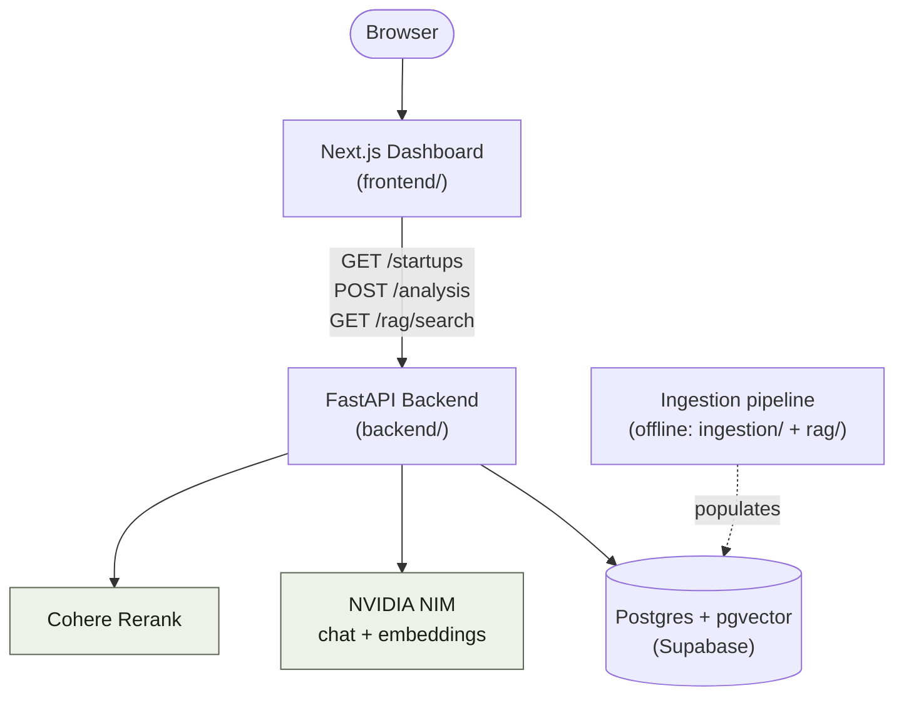
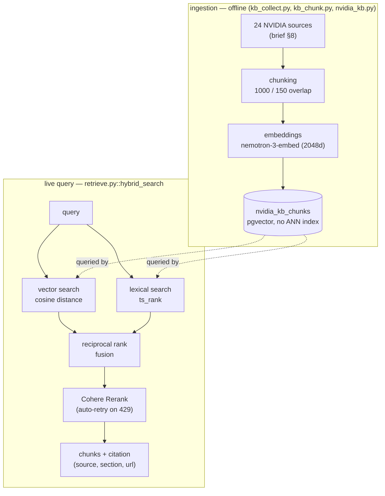
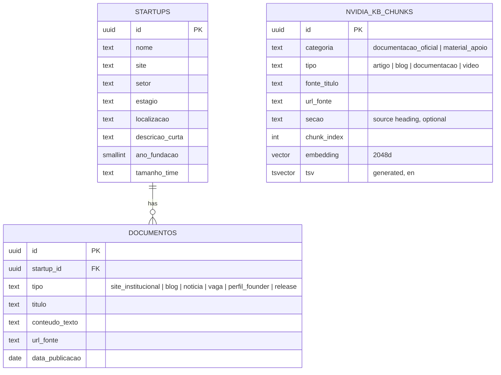

🇺🇸 English | 🇧🇷 [Ler em Português](ARCHITECTURE.md)

# NVIDIA Startup AI Radar Architecture

This document describes **how** the system works and **why** each relevant
technical decision was made. For installation and run instructions, see
[README.en.md](README.en.md).

## Contents

- [Overview](#overview)
- [System context diagram](#system-context-diagram)
- [Multi-agent pipeline (LangGraph)](#multi-agent-pipeline-langgraph)
- [Hybrid RAG + reranking](#hybrid-rag--reranking)
- [Differentiator: deterministic rule-based cross-check](#differentiator-deterministic-rule-based-cross-check)
- [Data model](#data-model)
- [Code map](#code-map)
- [Architectural decisions and their reasons](#architectural-decisions-and-their-reasons)
- [Known limitations](#known-limitations)
- [Stack](#stack)

## Overview

NVIDIA Startup AI Radar takes a natural-language question about Brazilian
startups (e.g. *"which startups use AI for voice customer service?"*),
selects the relevant companies from a pre-populated database, extracts and
validates a profile for each from real source documents, classifies its
AI-native maturity, searches a purpose-built NVIDIA knowledge base for
relevant technologies (hybrid RAG + reranking), and produces a final
recommendation with traceable evidence and citations. An independent,
LLM-free check runs alongside it as a second opinion.

Request flow, end to end:

1. The user types a question in the dashboard (Next.js).
2. The dashboard calls `POST /analysis` on the backend (FastAPI).
3. The backend invokes the LangGraph graph (8 agents, see next section),
   which reads and writes Postgres (Supabase) and calls NVIDIA NIM and
   Cohere Rerank.
4. The graph returns an aggregated briefing and, per startup, a
   recommendation with evidence. The dashboard renders all of it as cards.

This is synchronous and blocking by deliberate choice; see
[Architectural decisions](#architectural-decisions-and-their-reasons).

## System context diagram

There's no Docker and no self-hosted services: the backend/frontend run
locally (or on any host that can serve FastAPI/Next.js) against services
that are already hosted: Supabase, NVIDIA NIM, and Cohere. See
["No Docker"](#architectural-decisions-and-their-reasons) below for why.

## Multi-agent pipeline (LangGraph)

Implemented in [`backend/src/radar_backend/agents/graph.py`](backend/src/radar_backend/agents/graph.py).
There are 8 real agents, run in sequence; five of them (Extractor,
Classifier, Evidence Validator, NVIDIA RAG, Recommendation) run once **per
startup** the Retriever found.

```mermaid
flowchart LR
    U(["natural-language<br/>query"]) --> QP[["Query Planner"]]
    QP --> RET["Retriever"]
    RET -- "per startup returned" --> EXT[["Extractor"]]
    EXT --> CLS[["Startup Classifier"]]
    CLS --> EV[["Evidence Validator"]]
    EV -- "insufficient evidence<br/>and retry_count < 1" --> RET
    EV -- "evidence ok or<br/>retry exhausted" --> RAG["NVIDIA RAG"]
    RAG --> REC[["Recommendation<br/>+ deterministic rules"]]
    REC --> BRI["Briefing"]
    BRI --> UI(["dashboard"])

    classDef llm fill:#fbe4d5,stroke:#b3541e,color:#3a2a1c,stroke-width:1.5px;
    classDef logic fill:#eef1e9,stroke:#5c6555,color:#1a1f16,stroke-width:1px;
    class QP,EXT,CLS,EV,REC llm;
    class RET,RAG,BRI logic;
```

*Orange nodes call NVIDIA NIM (LLM); gray nodes are pure logic/SQL, no LLM.*

| Node | Calls LLM? | What it does | Code |
|---|---|---|---|
| Query Planner | yes | Turns the question into structured criteria (sector, stage, keywords, AI signals) | `graph.py::query_planner` |
| Retriever | no | Searches `startups`/`documentos` in Postgres via SQL (structured + full-text), ranked by relevance | `graph.py::_search_startups`, `_fetch_documentos` |
| Extractor | yes | Extracts a structured profile per startup from raw documents, instructed never to invent anything beyond the source | `graph.py::extractor` |
| Startup Classifier | yes | Classifies as `ai_native` / `ai_enabled` / `non_ai` | `graph.py::startup_classifier` |
| Evidence Validator | yes | Checks whether the extracted profile is supported by the available documents | `graph.py::evidence_validator` |
| NVIDIA RAG | no | Hybrid search + rerank over the NVIDIA knowledge base (see next section) | `graph.py::nvidia_rag`, `rag/retrieve.py` |
| Recommendation | yes | Recommends NVIDIA technologies based on the retrieved chunks; also runs the rule-based cross-check (differentiator) | `graph.py::recommendation`, `agents/rules.py` |
| Briefing | no | Aggregates the final state into a markdown report with no LLM call, so it can't hallucinate anything the other nodes didn't already validate | `graph.py::briefing` |

**The Evidence Validator's retry loop** is a single, bounded retry
(`MAX_RETRIES = 1`): if a startup is still short on evidence and still has
retry budget left, the graph loops back to the Retriever for a broader
search (no document cap this time); otherwise it proceeds anyway, flagging
the startup as low-confidence in the Briefing. There is no human review in
the loop. This choice comes directly from the league president's guidance:
avoiding a false negative matters more than absolute certainty, and stalling
the product waiting on a human wasn't a viable option.

## Hybrid RAG + reranking

Implemented in [`backend/src/radar_backend/rag/`](backend/src/radar_backend/rag/).
The NVIDIA knowledge base (24 sources from the brief: docs, blog posts, and
videos, listed in `kb_sources.py`) is ingested offline; the live query runs
two independent paths that merge before reranking.

Key points:

- **Never "vector or lexical"**: both paths always run, and the merge via
  *reciprocal rank fusion* (RRF) combines the rankings by position, not raw
  scale, since cosine distance and `ts_rank` aren't directly comparable.
- **Citations are precise and traceable**: every chunk carries
  `fonte_titulo`, `secao` (the h1-h4 heading it came from, when the source
  has that structure), and `url_fonte`, never a generic link to the
  source's homepage. The league president called this out explicitly as a
  credibility differentiator.
- **No ANN index (HNSW/ivfflat)**: pgvector caps indexed columns at 2000
  dimensions, and the current embedding model outputs 2048-dim vectors. At
  this scale (hundreds of chunks), a sequential scan for `<=>` is already
  fast enough, so it wasn't worth truncating/re-normalizing embeddings just
  to fit under the index limit.
- **Rerank has a fallback**: if `COHERE_API_KEY` isn't set, `rerank()`
  returns the RRF-ordered candidates unranked, instead of breaking the
  pipeline.

## Differentiator: deterministic rule-based cross-check

Implemented in [`backend/src/radar_backend/agents/rules.py`](backend/src/radar_backend/agents/rules.py),
called from inside the Recommendation node. It isn't its own graph node
(see [Architectural decisions](#architectural-decisions-and-their-reasons)).

A static table of ~15 real NVIDIA products (excluding catalog/program
entries like NVIDIA Inception, which aren't technologies to adopt), each
with Portuguese and English keyword signals. `match_rules` matches those
keywords against the startup's own profile text, never against the run's
shared search criteria (see `_profile_haystack`'s docstring for why that
matters). `cross_check` compares those matches against the
`tecnologias_recomendadas` the LLM itself returned:

- products **both methods** point to → `concordancia_regras`;
- a product the rule table flagged that the LLM didn't formally confirm →
  `alertas_regras`, a candidate false negative surfaced in the dashboard
  and briefing for human review.

Matching is **whole-word, in both directions** (`_best_matching_produto`),
not plain substring: this avoids both "CUDA" failing to match "CUDA
Toolkit" and "NeMo" incorrectly matching inside "NeMo Guardrails" (a
distinct product). It's a keyword heuristic, not a semantic check. An empty
`alertas_regras` means "the table found nothing to flag," not "there is no
gap at all": a signal phrased outside the table's keyword list can still
slip past both methods.

## Data model

`nvidia_kb_chunks` has no relationship to `startups`/`documentos`: it's the
NVIDIA knowledge base, independent of the startup dataset. All three tables
have RLS enabled with a public-read policy. That only matters if Supabase's
auto-generated REST/GraphQL API is queried directly, since the backend
connects as the `postgres` role and bypasses RLS regardless.

Migrations: [`0001_startups_documentos.sql`](backend/db/migrations/0001_startups_documentos.sql),
[`0002_nvidia_kb.sql`](backend/db/migrations/0002_nvidia_kb.sql). Applying
them: [`db/apply_sql.py`](backend/src/radar_backend/db/apply_sql.py) (see
README).

## Code map

### Backend (`backend/src/radar_backend/`)

| Path | Responsibility |
|---|---|
| `main.py` | FastAPI app boot |
| `core/config.py` | Settings via `pydantic-settings` (`DATABASE_URL`, `NVIDIA_API_KEY`, `COHERE_API_KEY`, model names) |
| `db/session.py` | psycopg connection to Postgres (Supabase) |
| `db/apply_sql.py` | Applies a `.sql` file (migration or seed) against `DATABASE_URL` |
| `api/routes.py` | HTTP routes: `/health`, `/startups`, `/analysis`, `/rag/search` |
| `agents/state.py` | `AgentState`, `StartupAnalysis`, `Recommendation`: the state schema shared by the graph's nodes |
| `agents/graph.py` | The 8 LangGraph nodes and edges (including the conditional retry) |
| `agents/llm.py` | Shared NVIDIA NIM chat client (`chat_json`), with retry |
| `agents/rules.py` | Deterministic rule table + `match_rules`/`cross_check` (differentiator) |
| `rag/kb_sources.py` | The 24 NVIDIA knowledge-base sources (brief §8) |
| `rag/kb_collect.py` | Collects and extracts text (or metadata, for videos) from each source |
| `rag/kb_chunk.py` | Chunking (`RecursiveCharacterTextSplitter`, 1000/150) |
| `rag/nvidia_kb.py` | Orchestrates ingestion + embeddings, writes the seed file |
| `rag/retrieve.py` | Hybrid search (vector + lexical) + RRF + Cohere rerank |
| `ingestion/` | Startup scraping pipeline, outside the brief's scope but built anyway: `sources.py` (candidates), `resolve.py` (domain resolution), `http.py`, `collect.py` (document collection), `pipeline.py` (orchestration) |

### Frontend (`frontend/src/`)

| Path | Responsibility |
|---|---|
| `app/page.tsx` | Main page, two tabs: Startups / Analysis |
| `app/layout.tsx` | Root layout, fonts (`next/font/google`) |
| `lib/api.ts` | Typed HTTP client for the backend |
| `components/startup-browser.tsx` | Filterable startup table (debounced) |
| `components/analysis-panel.tsx` | Query box → per-startup result cards, with citations and `.md` export |
| `components/ui/` | shadcn/ui (Radix) components |

## Architectural decisions and their reasons

- **Postgres + pgvector (Supabase) instead of Qdrant.** The brief explicitly
  allows this swap. It avoids running a second vector service and keeps the
  developer's machine free of containers.
- **No Docker.** All infrastructure is hosted (Supabase), so there's
  nothing to orchestrate locally.
- **Session pooler instead of Supabase's Direct connection.** The Direct
  connection hostname only has an IPv6 DNS record and silently fails to
  resolve on networks without working IPv6, which is common in Brazil.
- **Retriever uses OR, not AND, across structured criteria and text
  search.** A sector guessed by the LLM (Query Planner) rarely
  substring-matches the database's own freeform text; requiring every
  criterion to align zeroed out real results (found live: Fintalk never
  showed up). Switching to OR trades precision for recall, matching the
  project's false-negative avoidance priority.
- **`GET /startups` (browsing) uses AND, not OR.** This is deliberately
  different from the Retriever: there, the user is narrowing an
  already-visible list, so combining filters (AND) is the expected
  behavior; the Retriever optimizes for maximum recall during analysis
  instead.
- **Single, bounded retry in the Evidence Validator, no human review.**
  This avoids both an infinite loop and stalling the product waiting on a
  human. The issue moves to the Briefing as a low-confidence flag instead
  of blocking the pipeline.
- **Citations come straight from the retrieved chunks, never generated by
  the LLM.** The Recommendation's `evidencias` field is populated from the
  `nvidia_chunks` already fetched, not regenerated by the model, which
  rules out a hallucinated URL or excerpt ever appearing as a source.
- **The rule-based cross-check is a plain function call inside
  `recommendation()`, not its own graph node.** Nothing else in the graph
  consumes its output independently; a dedicated node, edge, and state
  field for a single-consumer computation would be unwarranted ceremony.
- **No ANN index (HNSW/ivfflat) on `nvidia_kb_chunks`.** pgvector caps
  indexes at 2000 dimensions and the current embedding model outputs 2048;
  at the current scale (hundreds of chunks) a sequential scan is already
  fast enough.
- **Startup nationality is founding location, not current domicile.** This
  is a direct clarification from the league president; it excluded one
  startup founded in Mexico even though it now operates in Brazil.

## Known limitations

- **Cohere's trial-plan rate limit** (10 req/min). Mitigated with automatic
  retry on 429, but can still add visible latency on large batches.
- **NVIDIA NIM's rate limit** (~40 requests/minute on the free tier,
  observed in practice, not officially documented). Not a code bug: a
  query can become visibly slower or fail with `503` under heavy use.
- **The rule-based cross-check is lexical, not semantic.** A signal phrased
  outside the keyword table (or only in another language) can slip past
  both the rule and the LLM.
- **`POST /analysis` doesn't survive a page refresh.** Being synchronous,
  if the user reloads the dashboard mid-run, the in-flight result is lost,
  since there's no persisted queue.

## Stack

| Layer | Technology |
|---|---|
| Agent orchestration | LangGraph |
| Backend | FastAPI, managed with `uv` |
| Database | Postgres (Supabase) + pgvector |
| LLM & embeddings | NVIDIA NIM (build.nvidia.com) |
| Reranking | Cohere Rerank |
| Frontend | Next.js, TypeScript, Tailwind, shadcn/ui (Radix) |
