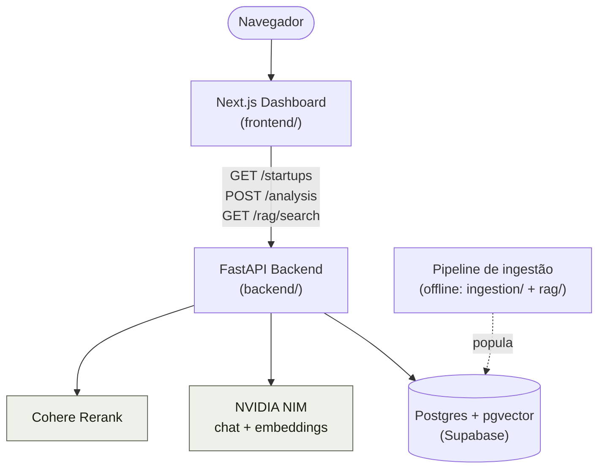
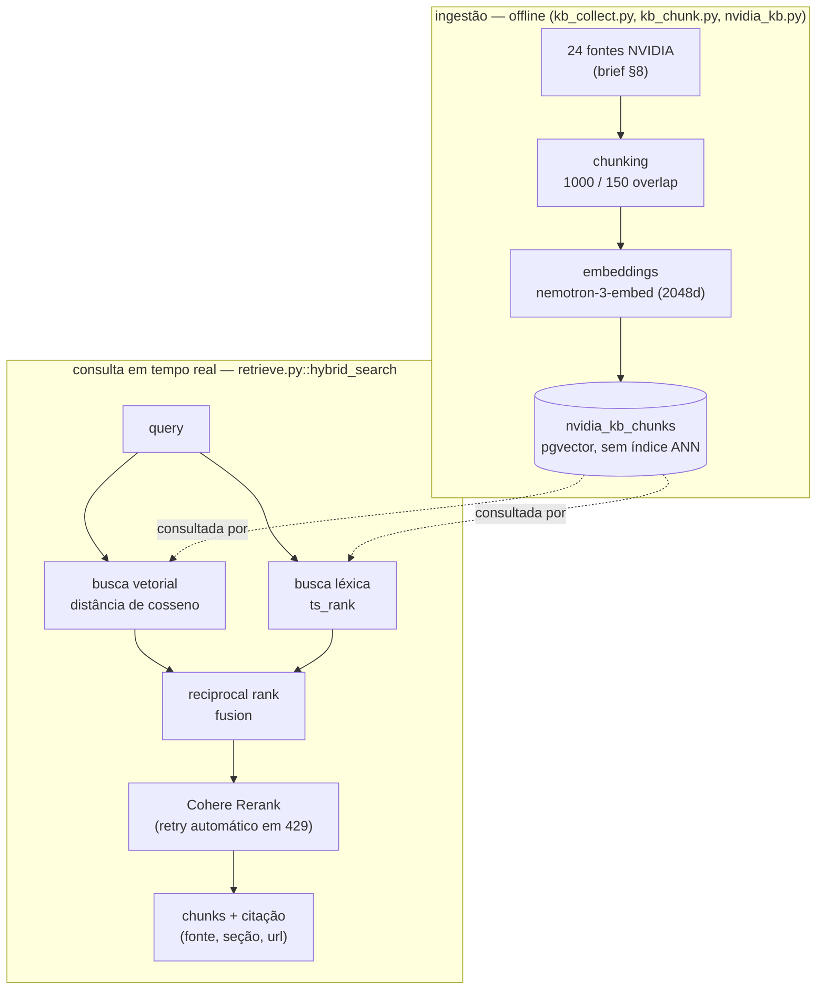
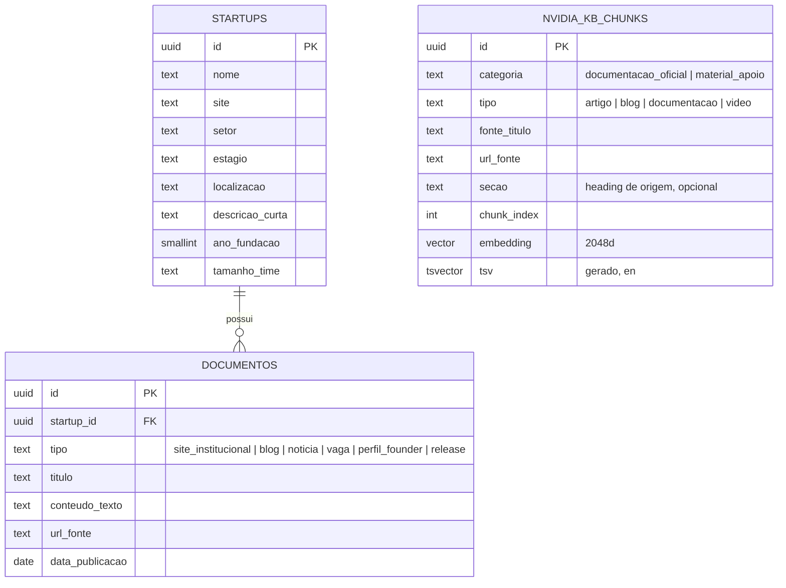

🇧🇷 Português | 🇺🇸 [Read in English](ARCHITECTURE.en.md)

# Arquitetura do NVIDIA Startup AI Radar

Este documento descreve **como** o sistema funciona e **por que** cada decisão
técnica relevante foi tomada. Para instruções de instalação e execução, veja o
[README.md](README.md).

## Sumário

- [Visão geral](#visão-geral)
- [Diagrama de contexto](#diagrama-de-contexto)
- [Pipeline multi-agente (LangGraph)](#pipeline-multi-agente-langgraph)
- [RAG híbrido + reranking](#rag-híbrido--reranking)
- [Diferencial: verificação cruzada por regras](#diferencial-verificação-cruzada-por-regras-determinísticas)
- [Modelo de dados](#modelo-de-dados)
- [Mapa de código](#mapa-de-código)
- [Decisões arquiteturais e seus porquês](#decisões-arquiteturais-e-seus-porquês)
- [Limitações conhecidas](#limitações-conhecidas)
- [Stack](#stack)

## Visão geral

O NVIDIA Startup AI Radar recebe uma pergunta em linguagem natural sobre
startups brasileiras (ex.: *"quais startups usam IA para atendimento por
voz?"*), seleciona as empresas relevantes numa base pré-populada, extrai e
valida um perfil de cada uma a partir de documentos reais, classifica sua
maturidade AI-native, busca tecnologias NVIDIA pertinentes numa base de
conhecimento própria (RAG híbrido + reranking) e produz uma recomendação
final com evidências e citações rastreáveis. Uma checagem independente, sem
LLM, roda em paralelo como segunda opinião.

Fluxo de uma requisição, de ponta a ponta:

1. O usuário digita a pergunta no dashboard (Next.js).
2. O dashboard chama `POST /analysis` no backend (FastAPI).
3. O backend invoca o grafo LangGraph (8 agentes, ver seção seguinte), que lê
   e escreve no Postgres (Supabase) e chama NVIDIA NIM e Cohere Rerank.
4. O grafo devolve um relatório (briefing) agregado e, por startup, uma
   recomendação com evidências. O dashboard renderiza tudo isso em cards.

Esse processo é síncrono e bloqueante por decisão deliberada (ver
[Decisões arquiteturais](#decisões-arquiteturais-e-seus-porquês)).

## Diagrama de contexto

Não há Docker nem serviços auto-hospedados: todo o backend/frontend roda
localmente (ou em qualquer host que sirva FastAPI/Next.js) contra serviços
já hospedados: Supabase, NVIDIA NIM e Cohere. Ver
["Sem Docker"](#decisões-arquiteturais-e-seus-porquês) abaixo para o porquê.

## Pipeline multi-agente (LangGraph)

Implementado em [`backend/src/radar_backend/agents/graph.py`](backend/src/radar_backend/agents/graph.py).
São 8 agentes reais, executados em sequência; cinco deles (Extractor,
Classifier, Evidence Validator, NVIDIA RAG, Recommendation) rodam uma vez
**para cada startup** que o Retriever encontrou.

```mermaid
flowchart LR
    U(["consulta em<br/>linguagem natural"]) --> QP[["Query Planner"]]
    QP --> RET["Retriever"]
    RET -- "por startup retornada" --> EXT[["Extractor"]]
    EXT --> CLS[["Startup Classifier"]]
    CLS --> EV[["Evidence Validator"]]
    EV -- "evidência insuficiente<br/>e retry_count < 1" --> RET
    EV -- "evidência ok ou<br/>retry esgotado" --> RAG["NVIDIA RAG"]
    RAG --> REC[["Recommendation<br/>+ regras determinísticas"]]
    REC --> BRI["Briefing"]
    BRI --> UI(["dashboard"])

    classDef llm fill:#fbe4d5,stroke:#b3541e,color:#3a2a1c,stroke-width:1.5px;
    classDef logic fill:#eef1e9,stroke:#5c6555,color:#1a1f16,stroke-width:1px;
    class QP,EXT,CLS,EV,REC llm;
    class RET,RAG,BRI logic;
```

*Nós laranja chamam NVIDIA NIM (LLM); nós cinza são lógica/SQL pura, sem LLM.*

| Nó | Chama LLM? | O que faz | Código |
|---|---|---|---|
| Query Planner | sim | Transforma a pergunta em critérios estruturados (setor, estágio, palavras-chave, sinais de IA) | `graph.py::query_planner` |
| Retriever | não | Busca `startups`/`documentos` no Postgres por SQL (estruturado + full-text), ranqueado por relevância | `graph.py::_search_startups`, `_fetch_documentos` |
| Extractor | sim | Extrai um perfil estruturado de cada startup a partir dos documentos brutos, instruído a não inventar nada fora da fonte | `graph.py::extractor` |
| Startup Classifier | sim | Classifica como `ai_native` / `ai_enabled` / `non_ai` | `graph.py::startup_classifier` |
| Evidence Validator | sim | Verifica se o perfil extraído é sustentado pelos documentos disponíveis | `graph.py::evidence_validator` |
| NVIDIA RAG | não | Busca híbrida + rerank na base de conhecimento NVIDIA (ver próxima seção) | `graph.py::nvidia_rag`, `rag/retrieve.py` |
| Recommendation | sim | Recomenda tecnologias NVIDIA com base nos trechos recuperados; roda também a checagem por regras (diferencial) | `graph.py::recommendation`, `agents/rules.py` |
| Briefing | não | Agrega o estado final num relatório markdown, sem chamada de LLM: não pode alucinar nada que os outros nós não validaram | `graph.py::briefing` |

**O laço de retry do Evidence Validator** é um retry único e limitado
(`MAX_RETRIES = 1`): se uma startup segue sem evidência suficiente e ainda
tem orçamento de retry, o grafo volta ao Retriever para uma busca mais ampla
(sem cap de documentos); caso contrário, segue adiante mesmo assim,
sinalizando a startup como baixa confiança no Briefing. Não há revisão
humana no laço. Essa escolha vem diretamente da orientação do presidente da
liga: evitar falso negativo é mais importante do que ter certeza absoluta, e
travar o pipeline esperando um humano não era uma opção viável para o
produto.

## RAG híbrido + reranking

Implementado em [`backend/src/radar_backend/rag/`](backend/src/radar_backend/rag/).
A base de conhecimento NVIDIA (24 fontes do brief: documentação, blog e
vídeos, listadas em `kb_sources.py`) é ingerida offline; a consulta em
tempo real percorre dois caminhos independentes que se fundem antes do
reranking.

Pontos importantes:

- **Nunca é "vetorial ou lexical"**: os dois caminhos sempre rodam, e a
  fusão por *reciprocal rank fusion* (RRF) combina os rankings por posição,
  não por escala bruta, já que distância de cosseno e `ts_rank` não são
  comparáveis diretamente.
- **Citações são precisas e rastreáveis**: cada chunk carrega `fonte_titulo`,
  `secao` (o heading h1-h4 de onde veio, quando a fonte tem estrutura) e
  `url_fonte`, nunca um link genérico para a página inicial da fonte. O
  presidente da liga citou isso explicitamente como diferenciador de
  credibilidade.
- **Sem índice ANN (HNSW/ivfflat)**: o pgvector limita colunas indexadas a
  2000 dimensões, e o modelo de embedding atual gera vetores de 2048
  dimensões. Nessa escala (centenas de chunks), uma varredura sequencial
  para `<=>` já é rápida o suficiente, então não valeu a pena
  truncar/re-normalizar embeddings só para caber no limite do índice.
- **Rerank tem fallback**: se `COHERE_API_KEY` não estiver configurada,
  `rerank()` devolve os candidatos já ordenados por RRF, sem quebrar o
  pipeline.

## Diferencial: verificação cruzada por regras determinísticas

Implementado em [`backend/src/radar_backend/agents/rules.py`](backend/src/radar_backend/agents/rules.py),
chamado dentro do nó Recommendation. Não é um nó de grafo próprio (ver
[Decisões arquiteturais](#decisões-arquiteturais-e-seus-porquês)).

Uma tabela estática de ~15 produtos NVIDIA reais (excluindo entradas de
catálogo/programa como NVIDIA Inception, que não são tecnologias a adotar),
cada um com sinais de palavra-chave em português e inglês. `match_rules`
casa essas palavras contra o texto do próprio perfil da startup, nunca
contra os critérios de busca da consulta, que são compartilhados entre
todas as startups do lote (o docstring de `_profile_haystack` explica por
que essa distinção importa). `cross_check` compara essas correspondências
com as `tecnologias_recomendadas` que o próprio LLM devolveu:

- produtos que **os dois métodos** apontam → `concordancia_regras`;
- um produto que a tabela de regras encontrou mas o LLM não confirmou
  formalmente → `alertas_regras`, um candidato a falso negativo exibido no
  dashboard e no briefing para revisão humana.

O casamento é por **palavra inteira em ambas as direções** (`_best_matching_produto`),
não por substring simples: isso evita tanto "CUDA" deixar de bater em "CUDA
Toolkit" quanto "NeMo" bater incorretamente dentro de "NeMo Guardrails" (um
produto distinto). É uma heurística por palavra-chave, não uma checagem
semântica. Um `alertas_regras` vazio significa "a tabela não encontrou nada
para sinalizar", não "não há lacuna alguma": um sinal fora da tabela de
palavras-chave ainda pode escapar dos dois métodos.

## Modelo de dados

`nvidia_kb_chunks` não tem relação com `startups`/`documentos`: é a base de
conhecimento NVIDIA, independente da base de startups. Nas três tabelas, RLS
está habilitado com política de leitura pública. Isso só é relevante se a
API REST/GraphQL auto-gerada do Supabase for consultada diretamente, já que
o backend conecta como role `postgres` e ignora RLS de qualquer forma.

Migrações: [`0001_startups_documentos.sql`](backend/db/migrations/0001_startups_documentos.sql),
[`0002_nvidia_kb.sql`](backend/db/migrations/0002_nvidia_kb.sql). Aplicação:
[`db/apply_sql.py`](backend/src/radar_backend/db/apply_sql.py) (ver README).

## Mapa de código

### Backend (`backend/src/radar_backend/`)

| Caminho | Responsabilidade |
|---|---|
| `main.py` | Boot do app FastAPI |
| `core/config.py` | Configuração via `pydantic-settings` (`DATABASE_URL`, `NVIDIA_API_KEY`, `COHERE_API_KEY`, nomes de modelo) |
| `db/session.py` | Conexão psycopg com o Postgres (Supabase) |
| `db/apply_sql.py` | Aplica um arquivo `.sql` (migração ou seed) contra `DATABASE_URL` |
| `api/routes.py` | Rotas HTTP: `/health`, `/startups`, `/analysis`, `/rag/search` |
| `agents/state.py` | `AgentState`, `StartupAnalysis`, `Recommendation`: esquema de estado compartilhado pelos nós do grafo |
| `agents/graph.py` | Os 8 nós do LangGraph e as arestas (incluindo o retry condicional) |
| `agents/llm.py` | Cliente compartilhado de chat NVIDIA NIM (`chat_json`), com retry |
| `agents/rules.py` | Tabela de regras determinísticas + `match_rules`/`cross_check` (diferencial) |
| `rag/kb_sources.py` | As 24 fontes da base de conhecimento NVIDIA (brief §8) |
| `rag/kb_collect.py` | Coleta e extrai texto (ou metadados, para vídeos) de cada fonte |
| `rag/kb_chunk.py` | Chunking (`RecursiveCharacterTextSplitter`, 1000/150) |
| `rag/nvidia_kb.py` | Orquestra ingestão + embeddings, gera o arquivo de seed |
| `rag/retrieve.py` | Busca híbrida (vetorial + léxica) + RRF + Cohere rerank |
| `ingestion/` | Pipeline de scraping das startups, fora do escopo do brief mas construído mesmo assim: `sources.py` (candidatos), `resolve.py` (resolução de domínio), `http.py`, `collect.py` (coleta de documentos), `pipeline.py` (orquestração) |

### Frontend (`frontend/src/`)

| Caminho | Responsabilidade |
|---|---|
| `app/page.tsx` | Página principal, duas abas: Startups / Análise |
| `app/layout.tsx` | Layout raiz, fontes (`next/font/google`) |
| `lib/api.ts` | Cliente HTTP tipado para o backend |
| `components/startup-browser.tsx` | Tabela filtrável de startups (debounce) |
| `components/analysis-panel.tsx` | Campo de consulta → cards de resultado por startup, com citações e export `.md` |
| `components/ui/` | Componentes shadcn/ui (Radix) |

## Decisões arquiteturais e seus porquês

- **Postgres + pgvector (Supabase) em vez de Qdrant.** O brief permite essa
  troca explicitamente. Evita manter um segundo serviço de vetores e mantém
  a máquina do desenvolvedor livre de containers.
- **Sem Docker.** Toda a infraestrutura é hospedada (Supabase), então não há
  nada para orquestrar localmente.
- **Session pooler em vez de Direct connection do Supabase.** O hostname de
  "Direct connection" só tem registro DNS IPv6 e falha silenciosamente em
  redes sem IPv6 funcional, o que é comum no Brasil.
- **Retriever usa OU, não E, entre critérios estruturados e busca textual.**
  Um setor "adivinhado" pelo LLM (Query Planner) raramente bate por
  substring com o texto livre do banco; exigir todos os critérios ao mesmo
  tempo zerava resultados reais (achado ao vivo: a Fintalk nunca aparecia).
  Trocar para OU prioriza recall sobre precisão, alinhado à diretriz de
  evitar falsos negativos.
- **`GET /startups` (navegação) usa E, não OU.** É um comportamento
  deliberadamente diferente do Retriever: ali o usuário está refinando uma
  lista já visível, então filtros que se combinam (E) são o esperado; no
  Retriever, o objetivo é recall máximo para a análise.
- **Retry único e limitado no Evidence Validator, sem revisão humana.**
  Evita tanto um laço infinito quanto travar o produto esperando um humano.
  O problema segue para o Briefing como um aviso de baixa confiança em vez
  de bloquear o pipeline.
- **Citações vêm direto dos chunks recuperados, nunca geradas pelo LLM.** O
  campo `evidencias` da Recommendation é preenchido com os `nvidia_chunks`
  já buscados, não regenerado pelo modelo, o que elimina a possibilidade de
  uma URL ou trecho alucinado aparecer como fonte.
- **Verificação por regras é uma função chamada dentro de
  `recommendation()`, não um nó de grafo próprio.** Nada mais no grafo
  consome sua saída isoladamente; um nó, aresta e campo de estado dedicados
  para um cálculo de único consumidor seria cerimônia desnecessária.
- **Sem índice ANN (HNSW/ivfflat) em `nvidia_kb_chunks`.** O pgvector
  limita índices a 2000 dimensões e o modelo de embedding atual gera 2048;
  na escala atual (centenas de chunks) a varredura sequencial já é rápida o
  bastante.
- **Nacionalidade de startup é o local de fundação, não o domicílio atual.**
  Esclarecimento direto do presidente da liga: excluiu uma startup fundada
  no México, ainda que opere no Brasil hoje.

## Limitações conhecidas

- **Rate limit do plano trial da Cohere** (10 req/min). Mitigado com retry
  automático em 429, mas ainda pode adicionar latência visível em lotes
  grandes.
- **Rate limit da NVIDIA NIM** (~40 requisições/minuto no plano gratuito,
  observado na prática, não documentado oficialmente). Não é um bug de
  código: uma consulta pode ficar visivelmente mais lenta ou falhar com
  `503` sob uso intenso.
- **Verificação por regras é lexical, não semântica.** Um sinal fora da
  tabela de palavras-chave (ou só em outro idioma) pode escapar tanto da
  regra quanto do LLM.
- **`POST /analysis` não sobrevive a um refresh de página.** Por ser
  síncrono, se o usuário recarregar o dashboard no meio de uma execução, o
  resultado em andamento é perdido, já que não há fila persistida.

## Stack

| Camada | Tecnologia |
|---|---|
| Orquestração de agentes | LangGraph |
| Backend | FastAPI, gerenciado com `uv` |
| Banco de dados | Postgres (Supabase) + pgvector |
| LLM & embeddings | NVIDIA NIM (build.nvidia.com) |
| Reranking | Cohere Rerank |
| Frontend | Next.js, TypeScript, Tailwind, shadcn/ui (Radix) |
